# Architecture — Antiques Marketplace

A React 18 single-page application with server-side rendering support, deployed on Vercel. The frontend communicates with Wix eCommerce via a thin layer of Vercel serverless functions that hold service credentials and handle authentication token exchange.

---

## 1. System Overview

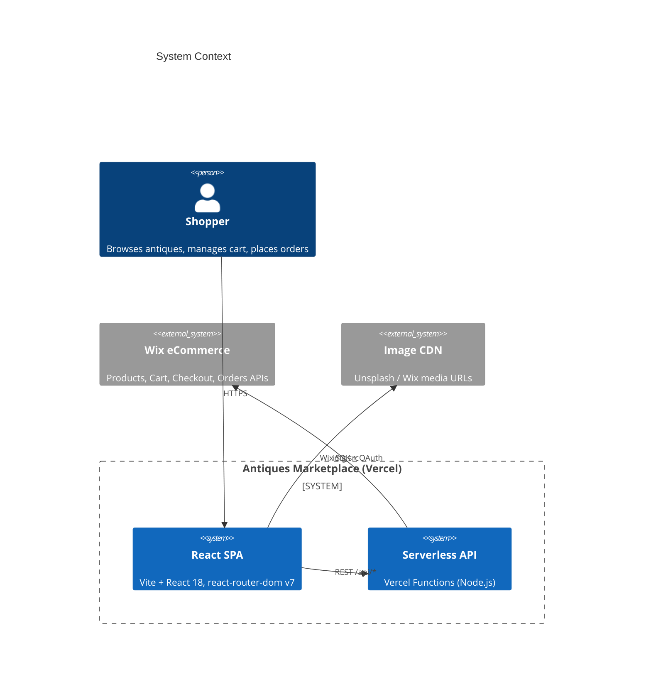

---

## 2. Deployment & Routing (Vercel)

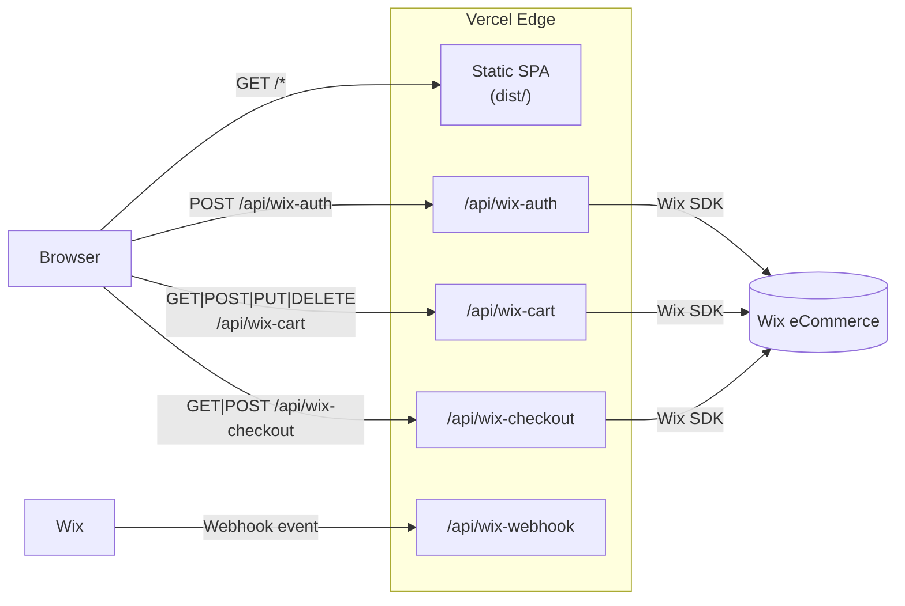

All `/api/*` rewrites are defined in `vercel.json`. CORS is handled per-function.

---

## 3. Frontend Module Map

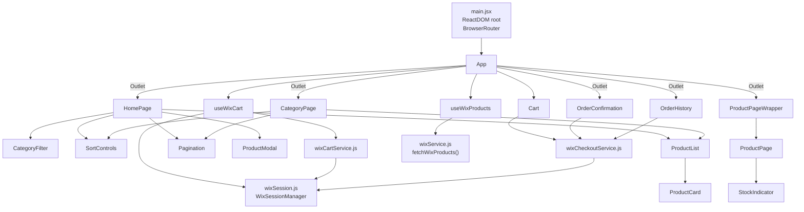

---

## 4. React Component Tree

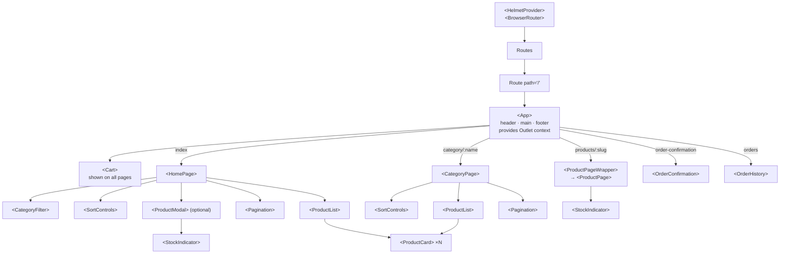

---

## 5. Data Flow — Product Loading

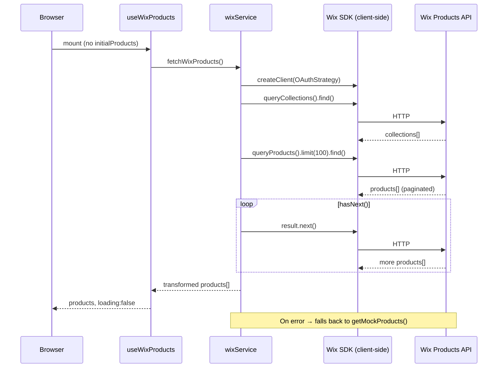

---

## 6. Cart Strategy — Hybrid Local / Wix

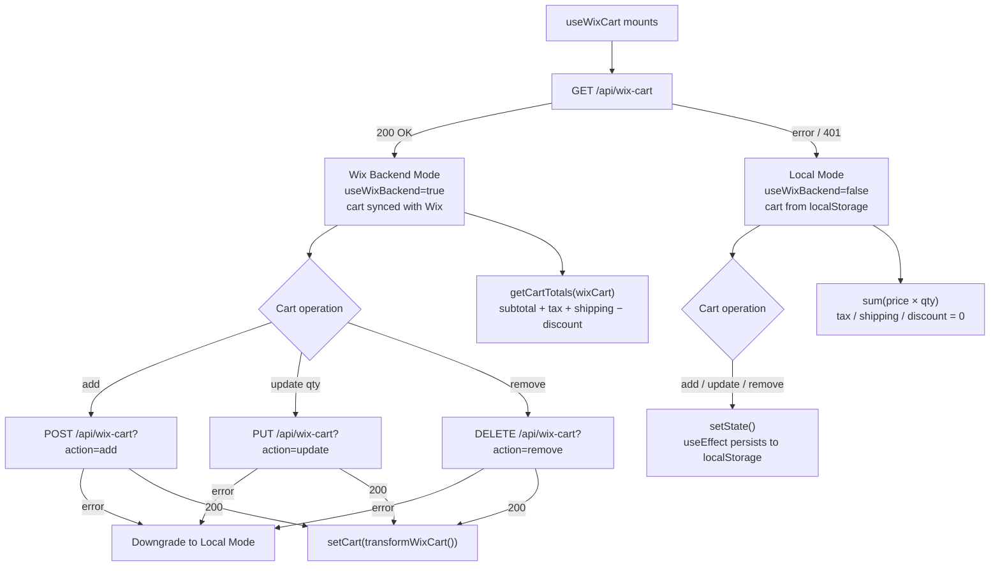

---

## 7. Session & Authentication Flow

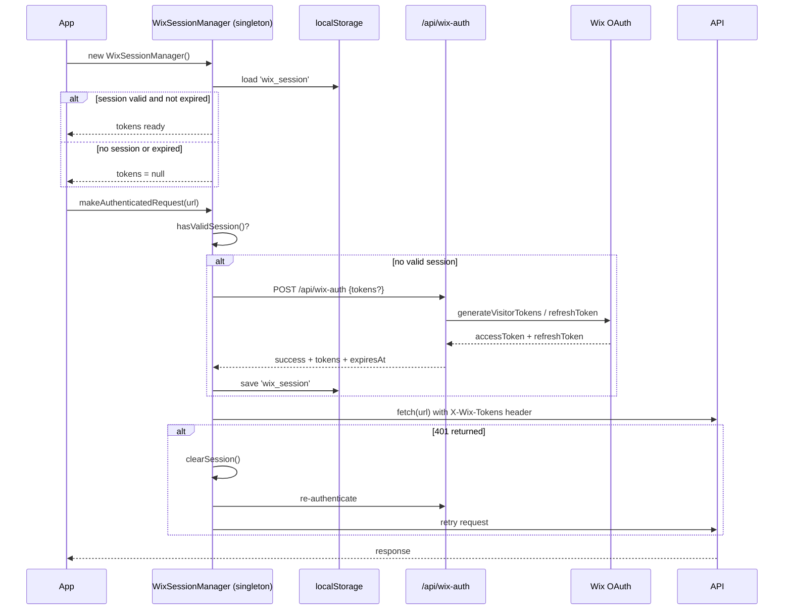

---

## 8. Checkout Flow

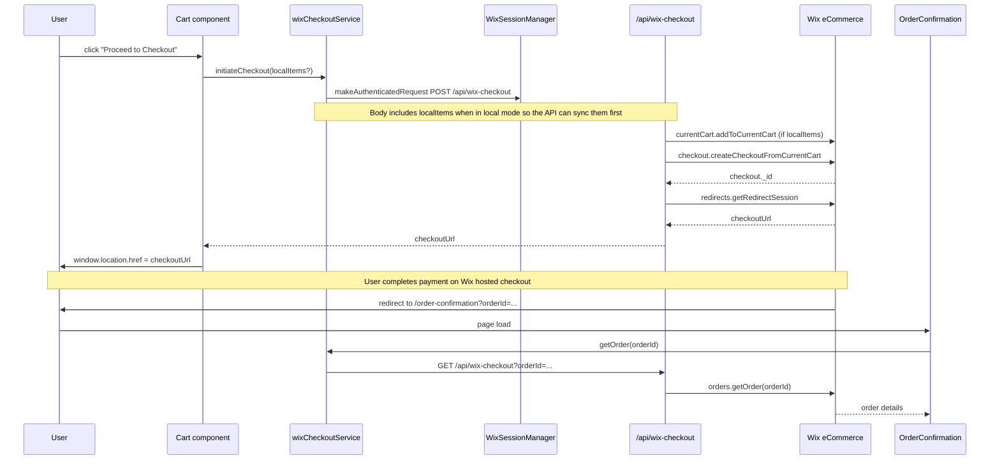

---

## 9. URL Routing

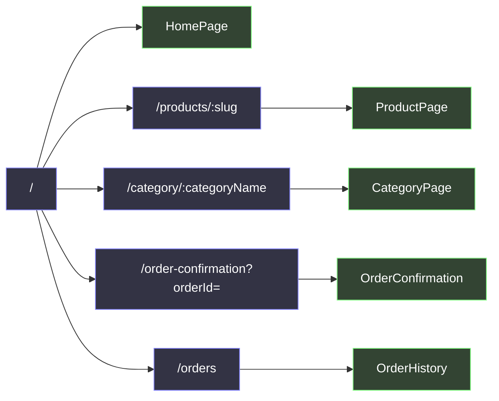

---

## 10. SEO & Structured Data

Each page injects `<head>` metadata via `react-helmet-async` and emits JSON-LD `<script>` blocks generated by `structuredData.js`.

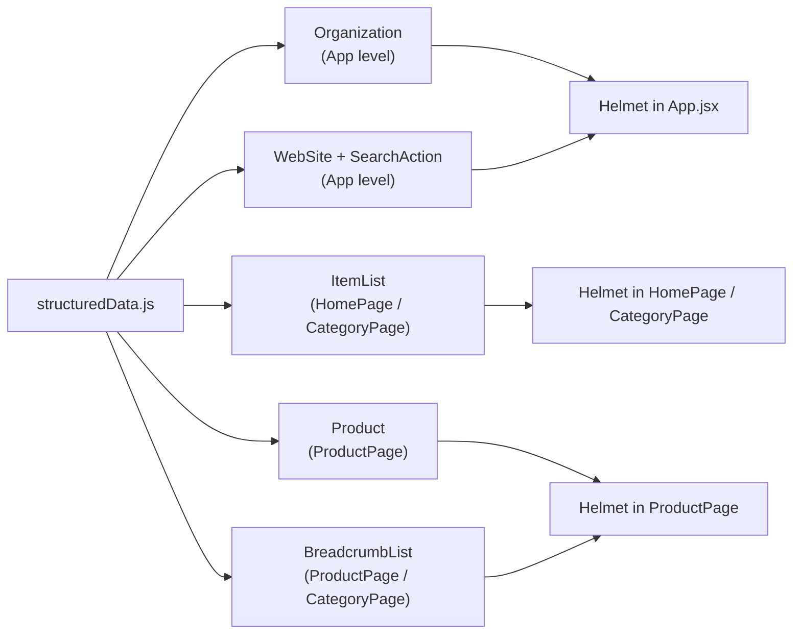

---

## 11. State Management Summary

There is no global state library. All state is owned at two levels and passed via React Router's Outlet context.

| Scope | Mechanism | What it holds |
|---|---|---|
| App-wide | `useWixProducts` in `App` → Outlet context | `products[]`, `categories[]`, `productCounts`, `loading`, `error` |
| App-wide | `useWixCart` in `App` → Outlet context | `cart[]`, `addToCart`, `removeFromCart`, `updateQuantity`, `totals` |
| Page-local | `useState` in `HomePage` / `CategoryPage` | `selectedCategory`, `sortBy`, `searchTerm`, `currentPage` |
| Persistent | `localStorage` | Cart items (local mode), Wix session tokens |

---

## 12. Key Dependencies

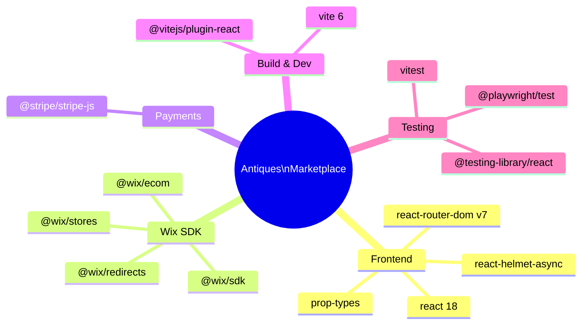
